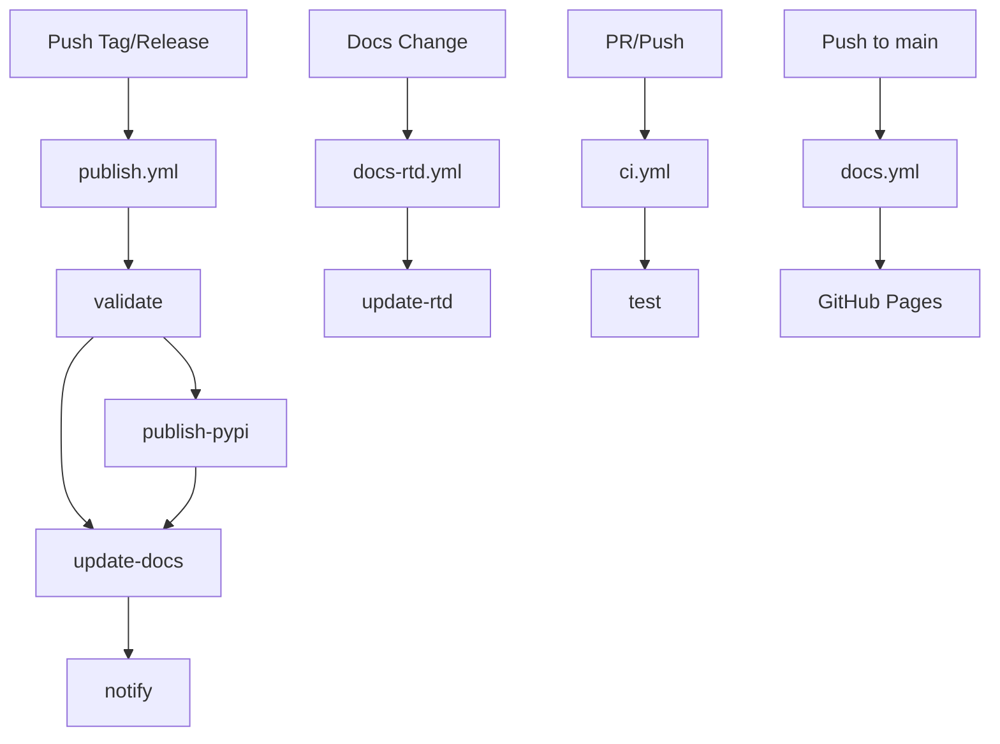

# GitHub Actions Setup for RAGLib

This document explains the GitHub Actions workflows for automated PyPI publishing and documentation updates.

## Workflows Overview

### 1. `publish.yml` - Main Publication Workflow

**Triggers:**
- 🏷️ When a new release is published on GitHub
- 🏷️ When version tags (v*) are pushed
- 🔧 Manual dispatch with options

**Features:**
- ✅ Validates package build and runs tests
- 📦 Publishes to PyPI (stable) or Test PyPI (prereleases)
- 📚 Updates GitHub Pages and triggers Read the Docs
- 🚀 Creates GitHub releases automatically
- 📊 Provides detailed deployment summaries

### 2. `docs-rtd.yml` - Documentation-only Updates

**Triggers:**
- 📝 Changes to documentation files (`docs/`, `mkdocs.yml`, etc.)
- 🏷️ New releases
- 🔧 Manual dispatch

**Features:**
- 📖 Triggers Read the Docs builds via webhook/API
- 🏠 Updates GitHub Pages as backup
- ✅ Validates documentation builds

### 3. `docs.yml` - GitHub Pages Documentation

**Triggers:**
- 📝 Pushes to main branch
- 🔍 Pull requests to main branch

**Features:**
- 🏗️ Builds MkDocs documentation
- 🌐 Deploys to GitHub Pages

### 4. `ci.yml` - Continuous Integration

**Triggers:**
- 🔄 Pushes to main/develop branches
- 🔍 Pull requests to main branch

**Features:**
- 🧪 Runs tests across Python versions
- 📊 Benchmarking and plugin discovery tests

## Required Secrets

Add these secrets to your GitHub repository settings:

### PyPI Secrets
```
PYPI_API_TOKEN          # Your PyPI API token for stable releases
TEST_PYPI_API_TOKEN     # Your Test PyPI API token for prereleases
```

### Read the Docs Secrets (Optional but Recommended)
```
RTD_WEBHOOK_TOKEN       # Read the Docs integration token
RTD_WEBHOOK_ID          # Read the Docs webhook ID
RTD_API_TOKEN          # Read the Docs API token (alternative to webhook)
```

## Setup Instructions

### 1. PyPI Setup

1. **Create PyPI Account**: Register at [pypi.org](https://pypi.org)
2. **Generate API Token**:
   - Go to Account Settings → API tokens
   - Create token with scope: "Entire account"
   - Copy the token (starts with `pypi-`)
3. **Add to GitHub Secrets**:
   - Repository Settings → Secrets and variables → Actions
   - Add `PYPI_API_TOKEN` with your token
4. **Test PyPI** (for prereleases):
   - Register at [test.pypi.org](https://test.pypi.org)
   - Generate token and add as `TEST_PYPI_API_TOKEN`

### 2. Read the Docs Setup

1. **Import Project**:
   - Go to [readthedocs.org](https://readthedocs.org)
   - Import your GitHub repository
   - Project name should be `raglib`

2. **Configure Project**:
   - Admin → Settings → Advanced Settings
   - Default version: `latest`
   - Default branch: `main`
   - Documentation type: `MkDocs`

3. **Setup Webhook** (Option A - Recommended):
   - Admin → Integrations → Add integration
   - Choose "GitHub incoming webhook"
   - Copy the webhook URL and secret
   - Extract webhook ID from URL: `https://readthedocs.org/api/v2/webhook/raglib/{WEBHOOK_ID}/`
   - Add secrets to GitHub:
     - `RTD_WEBHOOK_TOKEN`: The webhook secret
     - `RTD_WEBHOOK_ID`: The webhook ID

4. **Setup API Token** (Option B - Alternative):
   - Your account → Settings → API Tokens
   - Create token and add as `RTD_API_TOKEN`

### 3. GitHub Pages Setup

1. **Enable GitHub Pages**:
   - Repository Settings → Pages
   - Source: "GitHub Actions"
   - The workflow will automatically deploy

2. **Custom Domain** (Optional):
   - Add CNAME file or configure in settings
   - Update the `cname` value in `publish.yml`

## Usage Examples

### Releasing a New Version

#### Method 1: GitHub Release (Recommended)
```bash
1. Create and push a version tag:
   git tag v1.2.0
   git push origin v1.2.0

2. Go to GitHub → Releases → Draft a new release
3. Choose the tag, add release notes
4. Publish the release
   
→ This triggers automatic PyPI publication and docs update
```

#### Method 2: Manual Workflow Dispatch
```bash
1. Go to Actions → "Publish to PyPI and Update Docs"
2. Click "Run workflow"
3. Choose options:
   - Publish to PyPI: ✅
   - Update docs: ✅
   - Environment: production
```

### Documentation-only Updates

```bash
1. Make changes to docs/ files
2. Push to main branch
   
→ This triggers docs update without PyPI publication
```

### Emergency Manual Release

```bash
1. Go to Actions → "Release (Legacy)"
2. Provide tag name (e.g., v1.2.1)
3. Create as draft if needed
4. Manually publish to PyPI using main workflow
```

## Version Handling

### Stable Releases
- **Pattern**: `v1.0.0`, `v2.1.3`
- **PyPI**: Published to main PyPI
- **Docs**: Updated on Read the Docs and GitHub Pages

### Prereleases
- **Pattern**: `v1.0.0-alpha1`, `v2.0.0-beta2`, `v1.0.0-rc1`
- **PyPI**: Published to Test PyPI
- **Docs**: Updated with prerelease tag

### Development Versions
- **Pattern**: `v1.0.0-dev`, `v2.0.0.dev1`
- **PyPI**: Published to Test PyPI
- **Docs**: Updated but marked as development

## Troubleshooting

### PyPI Publication Fails
1. **Check API Token**: Ensure `PYPI_API_TOKEN` is valid
2. **Version Conflict**: Version might already exist on PyPI
3. **Package Name**: Ensure package name matches PyPI registration

### Read the Docs Not Updating
1. **Check Webhook**: Verify `RTD_WEBHOOK_TOKEN` and `RTD_WEBHOOK_ID`
2. **Manual Trigger**: Use RTD dashboard to manually trigger build
3. **Configuration**: Check `.readthedocs.yaml` file

### Documentation Build Fails
1. **Dependencies**: Check `docs/requirements.txt`
2. **MkDocs Config**: Validate `mkdocs.yml` syntax
3. **Local Test**: Run `mkdocs build` locally

## Monitoring

### Workflow Status
- **GitHub Actions**: Repository → Actions tab
- **Deployment Summary**: Check step summaries for detailed info
- **Artifacts**: Download build artifacts if needed

### External Services
- **PyPI**: Check [pypi.org/project/rag-techlib](https://pypi.org/project/rag-techlib)
- **Read the Docs**: Check [rag-techlib.readthedocs.io](https://rag-techlib.readthedocs.io)
- **GitHub Pages**: Check [rag-techlib.github.io](https://rag-techlib.github.io)

## Security Notes

- 🔐 API tokens are stored as GitHub secrets
- 🛡️ Workflows use minimal required permissions
- 🏢 Production environment protection can be enabled
- 📝 All actions are logged and auditable

## Workflow Dependencies



This setup provides a robust, automated pipeline for releasing your Python package and keeping documentation synchronized across multiple platforms.